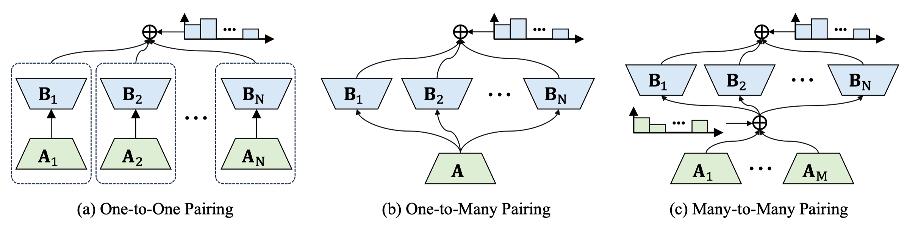
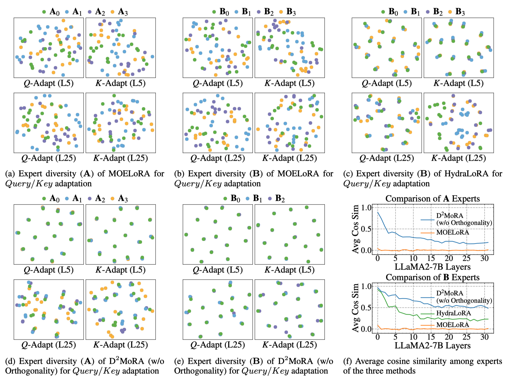
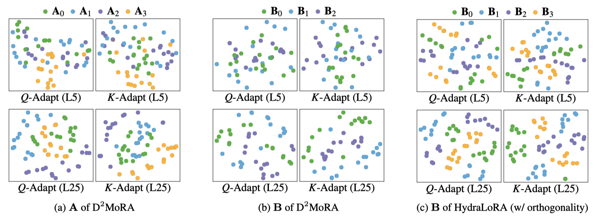

# [AAAI26] D<sup>2</sup>MoRA: Diversity-Regulated Asymmetric MoE-LoRA Decomposition for Efficient Multi-Task Adaptation

> Official implementation of the AAAI 2026 paper "D²MoRA: Diversity-Regulated Asymmetric MoE-LoRA Decomposition for Efficient Multi-Task Adaptation".

[](https://opensource.org/licenses/Apache-2.0)
[](https://www.python.org/)

## Authors

**Jianhui Zuo**<sup>1</sup>, **Xuemeng Song**<sup>2</sup>\*, **Haokun Wen**<sup>3,4</sup>, **Meng Liu**<sup>5</sup>, **Yupeng Hu**<sup>1</sup>, **Jiuru Wang**<sup>6</sup>, **Liqiang Nie**<sup>3</sup>\*

<sup>1</sup> School of Software, Shandong University  
<sup>2</sup> Department of Computer Science and Engineering, Southern University of Science and Technology  
<sup>3</sup> School of Computer Science and Technology, Harbin Institute of Technology (Shenzhen)  
<sup>4</sup> School of Data Science, City University of Hong Kong  
<sup>5</sup> School of Computer and Artificial Intelligence, Shandong Jianzhu University  
<sup>6</sup> School of Computer Science and Engineering, Linyi University  
\* Corresponding authors

## Links

- **Paper**: [AAAI Link](https://ojs.aaai.org/index.php/AAAI/article/view/40168)
- **Code Repository**: [GitHub](https://github.com/iLearn-Lab/AAAI26-D2MoRA)

---

## Table of Contents

- [Updates](#updates)
- [Introduction](#introduction)
- [Highlights](#highlights)
- [Method / Framework](#method--framework)
- [Project Structure](#project-structure)
- [Installation](#installation)
- [Usage](#usage)
- [Example Results](#example-results)
- [Citation](#citation)
- [License](#license)

---

## Updates

- [03/2026] Initial release and paper published at AAAI 2026.

---

## Introduction

This project is the official implementation of the paper **D<sup>2</sup>MoRA: Diversity-Regulated Asymmetric MoE-LoRA Decomposition for Efficient Multi-Task Adaptation**.

D<sup>2</sup>MoRA aims to address the limitation of existing MoE-LoRA methods in multi-task adaptation, where experts often become insufficiently diverse and the low-rank decomposition structure is overly constrained, leading to suboptimal expert specialization and parameter utilization. 

The core idea of D<sup>2</sup>MoRA is to introduce a diversity-regulated asymmetric MoE-LoRA decomposition, which decouples the low-rank adaptation structure and explicitly encourages experts to learn complementary rather than redundant knowledge through diversity regularization. Compared with existing methods, D<sup>2</sup>MoRA places greater emphasis on expert diversity and asymmetric decomposition, enabling more flexible knowledge sharing and stronger expert specialization while maintaining high parameter efficiency in multi-task adaptation.

---

## Highlights

- **Efficient Multi-Task Adaptation**: Resolves constraints in traditional MoE-LoRA architectures via asymmetric decomposition.
- **Diversity Regularization**: Explicitly encourages experts to learn complementary, non-redundant knowledge.
- **Comprehensive Evaluation**: Provides training and evaluation scripts tailored for LLaMA-7B and LLaMA2-7B.
- **State-of-the-Art Parameter Efficiency**: Achieves superior performance with significantly fewer parameters compared to baselines.

---

## Method / Framework



**Figure 1.** Comparison of MoE-enhanced LoRA: (a) One-to-one pairing with independent experts; (b) One-to-many pairing enabling knowledge sharing; (c) Our D 2 MoRA with asymmetric many-to-many pairing for flexible cross-expert sharing.

---

## Project Structure

```text
.
├── peft/                            # Source code directory for PEFT methods
├── .gitignore
├── DATA_LICENSE
├── LICENSE
├── README.md
├── commonsense_evaluate.py          # Evaluation script for commonsense tasks
├── evaluate.py                      # General evaluation script
├── export_hf_checkpoint.py          # Script to export Hugging Face checkpoints
├── export_state_dict_checkpoint.py  # Script to export state dict checkpoints
├── finetune.py                      # Main fine-tuning script
├── generate.py                      # Inference/generation script
├── lengths.ipynb
├── llama2_7B_D2MoRA.sh              # Shell script for LLaMA2-7B training
├── llama2_7B_D2MoRA_eval.sh         # Shell script for LLaMA2-7B evaluation
├── multi_dataset_eval.py            # Evaluation script across multiple datasets
├── pyproject.toml
└── requirements.txt                 # Project dependencies
```

-----

## Installation

### 1\. Clone the repository

```bash
git clone [https://github.com/iLearn-Lab/AAAI26-D2MoRA.git](https://github.com/iLearn-Lab/AAAI26-D2MoRA.git)
cd AAAI26-D2MoRA
```

### 2\. Create environment

We recommend using Anaconda to manage your environment:

```bash
conda create -n D2MoRA python=3.10 -y
conda activate D2MoRA
```

### 3\. Install dependencies

```bash
pip install -r requirements.txt
```


-----

## Usage

### Training

To train the model (e.g., LLaMA2-7B with D2MoRA), run the following script:

```bash
sh llama2_7B_D2MoRA.sh 16 32
```

### Evaluation

To evaluate the trained model on the benchmarks, use the provided evaluation script:

```bash
sh llama2_7B_D2MoRA_eval.sh
```

-----

## Example Results

**Table 1.** Performance comparison across multiple tasks using LLaMA-7B and LLaMA2-7B backbones.

| Model | PEFT Method | Param | BoolQ | PIQA | SIQA | HellaSwag | WinoGrande | ARC-c | ARC-e | OBQA | Avg. |
|---|---|---:|---:|---:|---:|---:|---:|---:|---:|---:|---:|
| LLaMA-7B | LoRA\<sub\>{M=1, N=1, r=64}\</sub\> | 50.3M | 68.47 | 80.09 | 76.56 | 78.83 | 78.69 | 60.75 | 76.56 | 74.60 | 74.32 |
| LLaMA-7B | DoRA\<sub\>{M=1, N=1, r=64}\</sub\> | 51.7M | 68.13 | 79.92 | 77.64 | 82.25 | 80.58 | 62.80 | 76.01 | 76.20 | 75.44 |
| LLaMA-7B | MoSLoRA\<sub\>{M=1, N=1, r=64}\</sub\> | 50.7M | 66.82 | 81.39 | **78.40** | 81.79 | **80.98** | 62.63 | 78.28 | 77.80 | 76.01 |
| LLaMA-7B | MOELoRA\<sub\>{M=8, N=8, r=8}\</sub\> | 50.4M | 69.39 | 79.90 | 76.21 | 81.14 | 80.76 | 62.41 | 78.53 | 78.70 | 75.88 |
| LLaMA-7B | MOELoRA\<sub\>{M=4, N=4, r=16}\</sub\> | 50.4M | 68.47 | 80.20 | 77.99 | 80.81 | 80.66 | 63.48 | 79.00 | 75.40 | 75.75 |
| LLaMA-7B | HydraLoRA\<sub\>{M=1, N=8, r=12}\</sub\> | 45.6M | 68.59 | 81.56 | 77.94 | 83.20 | 78.61 | 63.91 | 78.58 | 77.40 | 76.22 |
| LLaMA-7B | HydraLoRA\<sub\>{M=1, N=6, r=16}\</sub\> | 46.4M | 68.07 | 81.99 | 77.64 | 79.44 | 79.32 | 63.82 | 79.00 | **79.20** | 76.06 |
| LLaMA-7B | D\<sup\>2\</sup\>MoRA\<sub\>{M=3, N=8, r=8}\</sub\> | **35.8M** | 69.48 | 81.34 | 78.25 | 83.89 | 79.72 | 64.33 | **79.21** | 78.40 | 76.83 |
| LLaMA-7B | D\<sup\>2\</sup\>MoRA\<sub\>{M=3, N=4, r=16}\</sub\> | 45.6M | **69.66** | **82.86** | 77.22 | **85.95** | 80.58 | **64.68** | **79.21** | 77.20 | **77.17** |
| LLaMA2-7B | LoRA\<sub\>{M=1, N=1, r=64}\</sub\> | 50.3M | 70.91 | 81.34 | 76.20 | 81.41 | 80.19 | 63.99 | 77.31 | 76.80 | 76.02 |
| LLaMA2-7B | DoRA\<sub\>{M=1, N=1, r=64}\</sub\> | 51.7M | 68.65 | 81.12 | 78.45 | 86.64 | 81.06 | 65.02 | 78.24 | 79.20 | 77.30 |
| LLaMA2-7B | MoSLoRA\<sub\>{M=1, N=1, r=64}\</sub\> | 50.7M | 68.64 | 82.05 | 77.52 | 87.66 | 80.61 | 67.36 | 81.62 | 79.42 | 78.11 |
| LLaMA2-7B | MOELoRA\<sub\>{M=8, N=8, r=8}\</sub\> | 50.4M | 70.26 | 82.15 | **78.81** | 86.23 | 80.96 | 65.15 | 82.81 | 78.20 | 78.07 |
| LLaMA2-7B | MOELoRA\<sub\>{M=4, N=4, r=16}\</sub\> | 50.4M | 70.69 | 81.60 | 77.43 | 83.35 | **82.06** | 66.55 | 83.54 | 78.70 | 77.99 |
| LLaMA2-7B | HydraLoRA\<sub\>{M=1, N=8, r=12}\</sub\> | 45.6M | 69.52 | 82.81 | 78.56 | 87.82 | 80.58 | 67.28 | 81.29 | 79.80 | 78.46 |
| LLaMA2-7B | HydraLoRA\<sub\>{M=1, N=6, r=16}\</sub\> | 46.4M | 70.07 | 82.66 | **78.81** | 87.53 | 80.34 | 66.27 | 81.82 | 78.40 | 78.24 |
| LLaMA2-7B | D\<sup\>2\</sup\>MoRA\<sub\>{M=3, N=8, r=8}\</sub\> | **35.8M** | 70.40 | 82.26 | 78.76 | 87.72 | 81.53 | **70.65** | **84.01** | 78.80 | 79.27 |
| LLaMA2-7B | D\<sup\>2\</sup\>MoRA\<sub\>{M=4, N=3, r=16}\</sub\> | 45.6M | **71.31** | **82.86** | 78.40 | **90.11** | 81.68 | 67.06 | 83.38 | **81.00** | **79.48** |





-----


## Citation

If you find this project useful for your research, please consider citing our paper:

```bibtex
@inproceedings{zuo2026d2mora,
  title={D2MoRA: Diversity-Regulated Asymmetric MoE-LoRA Decomposition for Efficient Multi-Task Adaptation},
  author={Zuo, Jianhui and Song, Xuemeng and Wen, Haokun and Liu, Meng and Hu, Yupeng and Wang, Jiuru and Nie, Liqiang},
  booktitle={Proceedings of the AAAI Conference on Artificial Intelligence},
  volume={40},
  number={34},
  pages={29286--29294},
  year={2026}
}
```


-----

## License

This project is released under the [Apache License 2.0](https://opensource.org/licenses/Apache-2.0)
